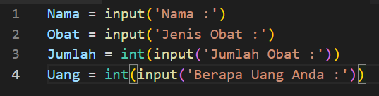
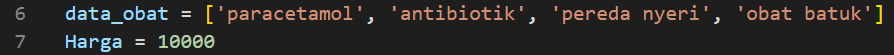
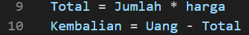
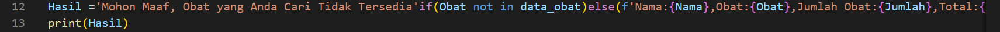
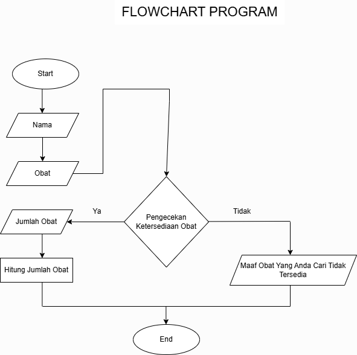

# PROGRAM APOTEK KIMIO FARMASI
## STUDI KASUS
Apotek Kimio Farmasi kesusahan dalam proses input customer yang sedang mencari obat, pengecekan ketersediaaan obat, dan penghitungan total dari harga obat tersebut. 
Pada program kali ini saya akan membantu Apotek Kimio Farmasi untuk membuatkan program tersebut. 
Dengan membuatkannya sebuah program inputan :
1. Nama
2.  Obat
3. Jumlah Obat
4. Jumlah uang

Setelah kita membuat program untuk inputan, kita buat data obat yang ada di Apotek Kimio Farmasi dan membuat harga dari obatnya.

Setelah memasukan daftar obat kita buat program yang akan menghitung harga total dan kembalian dengan rumus:
1. input jumlah obat * harga tiap jenis obatnya
2. Input jumlah uang - total harga obat

Setelah itu kita buat variabel baru yaitu hasil dimana program akan mencetak Nama, Obat, Jumlah Obat, Total Harganya, dan ketersediaan obat dari yang di inputkan pada Apotek Kimio Farmasi. Namun jika tidak tersedia, maka program akan mencetak pesan yang sesuai.

## FLOWCHART
